<h1 align="center">Hi, I'm Lohith Datta Varma Veepuri 👋</h1>

  

  
  
  
  

---

### 🚀 About Me

- 🔭 Software Engineer with 5+ years building secure, large scale distributed systems
- 🤖 Currently focused on LLM integration, RAG pipelines, and agentic AI tooling (LangGraph, MCP, function calling)
- 🏢 Experience across Costco, AMD, and JPMorgan Chase (via TCS)
- 🎓 M.S. in Computer Science, University of Central Missouri
- 💡 Interested in developer tooling, AI/ML integration, and high availability backend systems
- 📫 Reach me at lohithveepuri@gmail.com

---

### 🛠️ Tech Stack

  

---

### 📊 GitHub Stats

  
  

  

---

### 🐍 Contribution Snake

  

> Snake graph requires a one-time GitHub Actions workflow (file provided separately: `snake.yml`). It auto-generates and updates itself daily.

---

### 🏆 Featured Projects

## 🤖 Chitti
## Your personal AI assistant that actually *runs* your PC.

  

## AI for Predictive Healthcare Diagnosis

  

## 🧠 RecommendAI (AI-Based Product Recommendation System)
## Multi-engine e-commerce recommendation dashboard with real-time A/B testing and AI assistant.

  

---
- **AI-Powered Financial Insights Dashboard** — RAG pipeline over transaction data using FastAPI, React, OpenAI API, and PostgreSQL, cutting hallucinations by 40 percent
- **Intelligent Code Review Assistant** — Agentic LangGraph tool that reviews PRs, flags vulnerabilities, and posts GitHub feedback, cutting manual review time by 50 percent

---

<i>Thanks for visiting my profile!</i>

