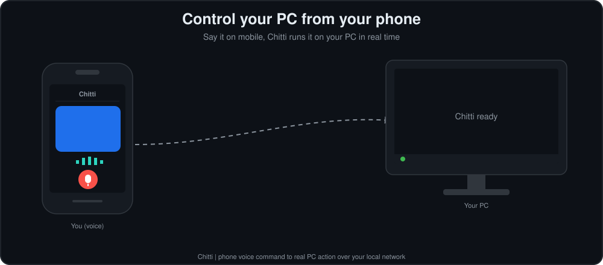
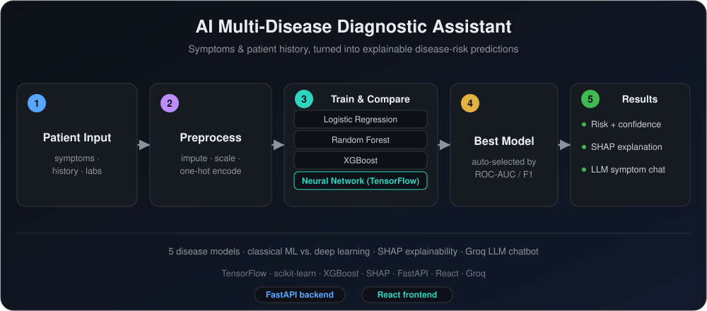

# Hi, I'm Lohith Datta Varma Veepuri 👋

  

  
  
  
  

---

### 🚀 About Me

- 🔭 Software Engineer with 5+ years building secure, large-scale distributed systems
- 🤖 Currently focused on LLM integration, RAG pipelines, and agentic AI tooling (LangGraph, MCP, function calling)
- 🏢 Experience across Costco, AMD, and JPMorgan Chase
- 🎓 M.S. in Computer Science, University of Central Missouri
- 💡 Interested in developer tooling, AI/ML integration, and high-availability backend systems
- 📫 Reach me at lohithveepuri@gmail.com

---

### 🛠️ Tech Stack

  

---

### 📊 GitHub Stats

  
  

  

---

### 🐍 Contribution Snake

  

> The snake graph is generated daily by a GitHub Actions workflow (see .github/workflows/snake.yml in this repository).

---

### 🏆 Featured Projects

#### 🤖 Chitti — Personal AI Assistant
Your personal AI assistant that can interact with your PC to automate tasks and workflows.

  

#### AI for Predictive Healthcare Diagnosis
An end-to-end pipeline for predictive healthcare diagnosis including preprocessing, model comparison, and explainable results.

  

#### 🧠 RecommendAI — AI-Based Product Recommendation System
Multi-engine e-commerce recommendation dashboard with real-time A/B testing and an AI assistant.

  

---

- **AI-Powered Financial Insights Dashboard** — RAG pipeline over transaction data using FastAPI, React, OpenAI API, and PostgreSQL, reducing hallucinations and improving result accuracy
- **Intelligent Code Review Assistant** — Agentic LangGraph tool that reviews PRs, flags vulnerabilities, and posts GitHub feedback, reducing manual review time

---

<i>Thanks for visiting my profile!</i>

